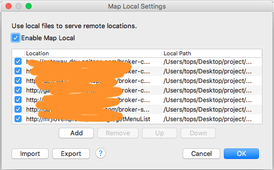
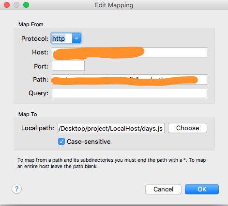

# 使用Charles

> 下载Charles安装使用（这个就不需要详细说明了吧）[下载地址](http://xclient.info/search/s/charles/?_=6ed98f309787b6f738f14f30cecdaa1a)

设置代理，代理地址就是电脑的ip地址

端口号可以随意设置

接下来设置手机设备上的代理地址，确保手机的代理地址就是电脑的ip地址
 
如无意外，会出现以下提示框，点击Allow就行

    
# 注意，因为我公司路由配置是一个总的路由，分路由配置网络（就是说，有一个总的路由链接网络运营商，用很多子路由链接总路由）手机链接的是子路由，如果电脑的IP网段和被代理的手机设备不再同一网段是无法做到抓包的，解决方案就是，用网线直连电脑设备，网线直连总路由，这样就能确保抓包。

## moke网络数据
许多时候APP做开发，都是先画界面，然后再去和服务端对接口，但是很多时候，发现界面画好了，但是服务端木有数据，这时候我们就需要模拟网络请求数据。
把远程服务端地址映射到本地数据
  
因为本地写的数据使用js格式写的，所以需要对请求回来的数据格式做修改
  
模拟数据完成，就可以根据字段来填充数据了

